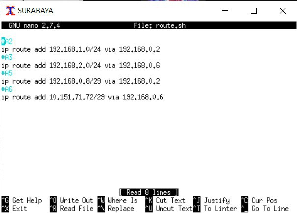
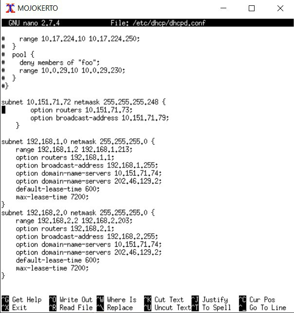

# Jarkom_Modul5_Lapres_E08

# Persiapan
## A. Membuat topologi jaringan sesuai soal
- Buat file dengan nama ```topologi.sh```
- 

## B. Melakukan Subnetting dengan metode VLSM
- Pembagian Subnet dengan metode VLSM
- 
- IP Tree
- 

## C. Melakukan Routing
Melakukan Routing pada UML Surabaya
- 

## D. Memberikan ip pada subnet SIDOARJO dan GRESIK secara dinamis menggunakan bantuan DHCP SERVER serta setting DHCP RELAY pada router yang menghubungkannya
- Pada UML Surabaya, Batu, dan Kediri -> Buka file ```nano /etc/sysctl.conf```
- Ubah agar menjadi seperti gambar di bawah ini
- 
- Jalankan ```sysctl -p```
- Install DHCP RELAY ```apt-get install isc-dhcp-relay -y```
- Buka file ```nano /etc/default/isc-dhcp-relay```
- Ubah agar menjadi seperti gambar di bawah ini
- 

- Pada UML Mojokerto, Install DHCP ```apt-get install isc-dhcp-server -y```
- Buka file ```nano /etc/default/isc-dhcp-server```
- Tambahkan ```INTERFACES="eth0"```
- Buka file ```nano /etc/dhcp/dhcpd.conf```
- Ubah agar menjadi seperti gambar di bawah ini
- 

# Soal
## 1
- Pada UML Surabaya, jalankan ```iptables -t nat -A POSTROUTING -s 192.168.0.0/16 -o eth0 -j SNAT --to-source 10.151.70.38```
- Cek dengan ```ping its.ac.id``-> Jika bisa maka nomor 1 berhasil

## 2
- Pada UML Surabaya, jalankan ```iptables -A FORWARD -d 10.151.71.72/29 -i eth0 -p tcp --dport 22 -j DROP```
- Install netcat di UML Mojokerto dan UML Malang ```apt-get install netcat```
- Pada putty, jalankan ```nc 10.151.77.131 22```
- Pada UML Mojokerto dan Malang, jalankan ```nc -l -p <nomor_port>```
- 

## 3
- Pada UML Mojokerto dan UML Malang, jalankan ```iptables -A INPUT -p icmp -m connlimit --connlimit-above 3 --connlimit-mask 0 -j DROP```
- Melakukan ping ke IP MALANG atau IP MOJOKERTO di 4 UML
- Dinyatakan berhasil jika di UML ke 4 tidak bisa melakukan ping
- 
